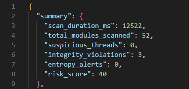

# SysProbe


A small, read-only Windows memory inspection tool that reports integrity signals for running processes.

## About

SysProbe inspects live process memory with a defensive focus. It does not modify memory or create threads.
Output is JSON so it can be ingested by other tools, with a short summary block at the top.
It is intentionally narrow in scope and meant for analysis and triage, not as a replacement for full security products.


## Quickstart (Windows)

```powershell
cargo build
cargo run -- --pid 1234 --scan-mode fast --json report.json
```

Deep scan (stack unwind + integrity verification):

```powershell
cargo run -- --pid 1234 --scan-mode deep --json report.json
```

If direct syscalls are unstable on your system, use `--api-mode` to call exported NTDLL functions:

```powershell
cargo run -- --pid 1234 --scan-mode deep --api-mode --json report.json
```

## Demo output (short)

```text
{
  "summary": {
    "scan_duration_ms": 1450,
    "total_modules_scanned": 142,
    "suspicious_threads": 2,
    "integrity_violations": 1,
    "entropy_alerts": 0,
    "risk_score": 70
  },
  "pid": 1234,
  ...
}
```

Summary fields:
- `scan_duration_ms`: total time for the scan pipeline.
- `total_modules_scanned`: number of modules discovered from the PEB list.
- `suspicious_threads`: threads with start-address or stack anomalies.
- `integrity_violations`: modules with inline or hash mismatches (after relocation masking).
- `entropy_alerts`: MEM_PRIVATE + RWX regions with high entropy.
- `risk_score`: highest severity found across all correlated findings.

## Screenshot



```mermaid
flowchart TD
  A[Target PID] --> B[OpenProcess + Memory Map]
  B --> C[Module List (PEB)]
  B --> D[Region Scan]
  B --> E[Thread Scan]
  E --> F[Stack Unwind]
  C --> G[Integrity Verifier]
  G --> H[Hotpatch Allowlist]
  D --> I[Entropy Scan]
  F --> J[Stack Findings]
  G --> K[Integrity Findings]
  I --> L[Region Findings]
  J --> M[Correlation Engine]
  K --> M
  L --> M
  M --> N[JSON Report + Summary]
```

## CLI examples

- `cargo run -- --pid 1234 --scan-mode fast`
- `cargo run -- --pid 1234 --scan-mode deep --json report.json`
- `cargo run -- --scan-mode deep --api-mode`
- `cargo run -- --scan-mode fast --no-integrity --no-stack`

## Defensive scope

- No memory modification
- No process creation or remote thread utilities
- Read-only observation and reporting

## Limitations

- User-Mode only: this tool runs in Ring 3.
- Results depend on which modules are loaded in the current process.
- Packed or protected processes can reduce visibility.
- Signature checks rely on local trust stores and do not fetch remote revocation data.


